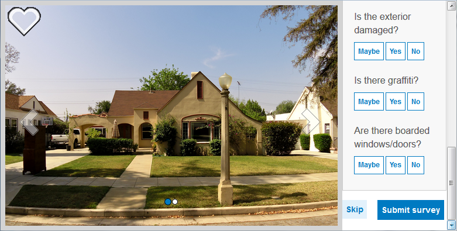

s# photo-survey

Photo Survey is a configurable JavaScript application designed to crowdsource property damage assessments, inventory blighted properties, target reappraisal efforts, identify structures that could pose safety concerns, as well as gather information from photos collected from camera traps, such as wildlife photos.

This application includes data management tools designed to process photos and publish pre-authored survey questions.

* Try the [Photo Survey (Local Government) application](http://links.esri.com/localgovernment/tryit/PhotoSurveys/)
* Try the [Damage Assessment Survey application](http://links.esri.com/stategovernment/tryit/PhotoSurveys/)
* Try the [Wildlife Photo Survey application](http://links.esri.com/stategovernment/tryit/wildlifephotosurveys/)

## Features

* Conduct focused property surveys (for example: identify blight, damaged structures, or construction activity.)
* Leverage location-enabled photos produced by commercially available cameras and simplify data processing so street-level photo collections can be gathered on a regular basis

## Requirements

**Start now using Esri-supplied sample services and maps**

You can start using the application now by setting it up on a web server running Microsoft Internet Information Services (IIS) and using sample services supplied by Esri.
You'll need to convert to an application in IIS and use the ASP .NET 4.0 or 4.5. application pool.

**Start now using your own services and maps**

For more information on requirements and publication steps, see [Photo Survey for Local Government](http://solutions.arcgis.com/local-government/help/photo-surveys/) help or the [Photo Survey for State Government](http://solutions.arcgis.com/state-government/help/photo-surveys/) help.

## Resources

Learn more about Esri's ArcGIS for [Local Government](http://solutions.arcgis.com/local-government/) and [State Government](http://solutions.arcgis.com/state-government/) maps and apps.

* Show me a [list] (http://esri.github.io/#Local-Government) of other Local Government GitHub repositories.
* Show me a [list] (http://esri.github.io/#State-Government) of other State Government GitHub repositories.

## Selecting Your Configuration

The photo-survey repo contains three unique application configurations: Property Survey, Damage Assessment Survey, and Wildlife Photo Survey.

To get the Property Survey configuration, use the default configuration.json.

To get the Damage Assessment Survey configuration, rename the configurationDamage.json to configuration.json.

To get the Wildlife Photo Survey configuration, rename the configurationWildlife.json to configuration.json.

## Issues

Find a bug or want to request a new feature?  Please let us know by submitting an issue.

## Contributing

Esri welcomes contributions from anyone and everyone.
Please see our [guidelines for contributing](https://github.com/esri/contributing).

## Licensing

Copyright 2015 Esri

Licensed under the Apache License, Version 2.0 (the "License");
you may not use this file except in compliance with the License.
You may obtain a copy of the License at

   http://www.apache.org/licenses/LICENSE-2.0

Unless required by applicable law or agreed to in writing, software
distributed under the License is distributed on an "AS IS" BASIS,
WITHOUT WARRANTIES OR CONDITIONS OF ANY KIND, either express or implied.
See the License for the specific language governing permissions and
limitations under the License.

A copy of the license is available in the repository's
[LICENSE.txt](https://github.com/Esri/photo-survey/blob/master/License.txt) file.
